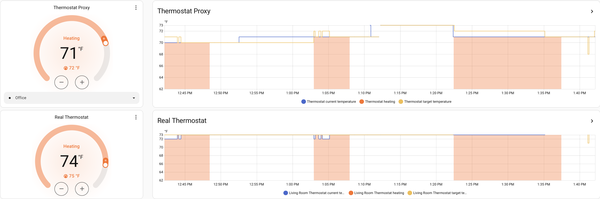

# ⚠️ Caution

This integration is still in the early days of development, so it is not yet recommended to create automations around it.

# Thermostat Proxy (Home Assistant)


A Home Assistant custom integration that lets you expose a virtual `climate` entity which mirrors a real thermostat but lets you pick any temperature sensor to act as the “current temperature”. When you change the virtual target temperature, the integration calculates the difference between the selected sensor and the requested set point, then offsets the real thermostat so it behaves as if it were reading the chosen sensor.

## Installation via HACS

[](https://my.home-assistant.io/redirect/hacs_repository/?repository=thermostat-proxy&category=integration&owner=jianyu-li)




## Features

- Wraps an existing `climate` entity; copies all of its attributes for dashboards/automations.
- Supports any number of temperature sensors. Each named sensor becomes a `preset_mode`, so changing the preset swaps the active sensor.
- Falls back to the real thermostat’s `current_temperature` whenever the selected sensor is unknown or unavailable.
- `climate.set_temperature` service adjusts the linked thermostat by the delta between the selected sensor reading and your requested temperature.
- Exposes helper attributes: active sensor, sensor entity id, real current temperature, and the last real target temperature.
- Remembers the previously selected sensor/target temperature across restarts and surfaces an `unavailable_entities` attribute so you can monitor unhealthy dependencies.
- Always adds a built-in preset for the wrapped thermostat’s own temperature reading (named `Physical Entity` by default, but you can rename it during setup) so you can revert or set it as the default sensor.

## How It Works

- `current_temperature` reflects the selected sensor. If its state is `unknown`/`unavailable`, the entity reports the real thermostat’s own temperature.
- `preset_modes` is populated with the configured sensor names. Calling `climate.set_preset_mode` switches the sensor.
- When you call `climate.set_temperature` on the custom entity, it calculates `delta = requested_temp - displayed_current_temp` and then sets the real thermostat to `real_current_temp + delta`. A two-degree increase relative to the virtual sensor becomes a two-degree increase on the physical thermostat, for example.
- Requested targets are clamped to the physical thermostat’s `min_temp`, `max_temp`, and `target_temp_step` so automations can’t push the hardware outside its supported range.
- All attributes from the physical thermostat are forwarded as extra attributes, alongside:
  - `active_sensor`
  - `active_sensor_entity_id`
  - `real_current_temperature`
  - `real_target_temperature`
  - `sensor_options`
  - `unavailable_entities`

## Automations / Service Examples

Switch the active sensor (preset):

```yaml
action: climate.set_preset_mode
target:
  entity_id: climate.living_room_proxy
data:
  preset_mode: Kitchen
```

Set a sensor-based target temperature:

```yaml
action: climate.set_temperature
target:
  entity_id: climate.living_room_proxy
data:
  temperature: 73
```

The integration will take the currently selected sensor’s temperature, compare it to the requested value, and offset the real thermostat accordingly.

Automatically move the proxy to the kitchen sensor whenever the fireplace is running so the extra heat doesn’t throw off the default thermostat, then fall back to the physical preset (renamed if you customized it) once the fire is off:

```yaml
alias: Thermostat Mode Adjust
description: Automatically adjust thermostat proxy preset mode.
triggers:
  - trigger: state
    entity_id:
      - switch.fireplace
    to:
      - "on"
    id: Fireplace On
    from:
      - "off"
  - trigger: state
    entity_id:
      - switch.fireplace
    to:
      - "off"
    id: Fireplace Off
    from:
      - "on"
conditions: []
actions:
  - choose:
      - conditions:
          - condition: trigger
            id:
              - Fireplace On
        sequence:
          - action: climate.set_preset_mode
            data:
              preset_mode: Kitchen
            target:
              entity_id: climate.custom_thermostat
      - conditions:
          - condition: trigger
            id:
              - Fireplace Off
        sequence:
          - action: climate.set_preset_mode
            data:
              preset_mode: Physical Entity
            target:
              entity_id: climate.custom_thermostat
mode: single
```

## Limitations / Notes

- The component assumes a single target temperature (heat, cool, or auto with a shared set point). Dual set points (`target_temp_low` / `target_temp_high`) are not supported.
- Because Home Assistant does not expose the real thermostat’s precision/step directly, changes to `current_temperature` or the linked thermostat may momentarily desync the displayed target temperature if another integration changes the physical thermostat. The entity exposes the real target temperature as an attribute so you can reconcile differences.
- **Whole-degree sensors will appear “off by one” whenever the wrapped thermostat supports finer precision (0.5°, 0.1°, etc.).** The custom entity only knows the rounded value from that whole-degree sensor, so it must treat every change as a full degree while the physical thermostat can still react in smaller steps. In practice this means the virtual thermometer may say “1° below target” while the real thermostat has already closed the gap. 
- **Virtual target may “self-adjust” after the physical thermostat reports an update.** When the integration notices the real thermostat’s target or current temp changed outside of Home Assistant, you may see a slight change in the virtual setpoint as `sensor + (real_target - real_current)` so the two stay in sync. 

## Contributing

Contributions are welcome! Feel free to create a new branch and submit pull a request!
